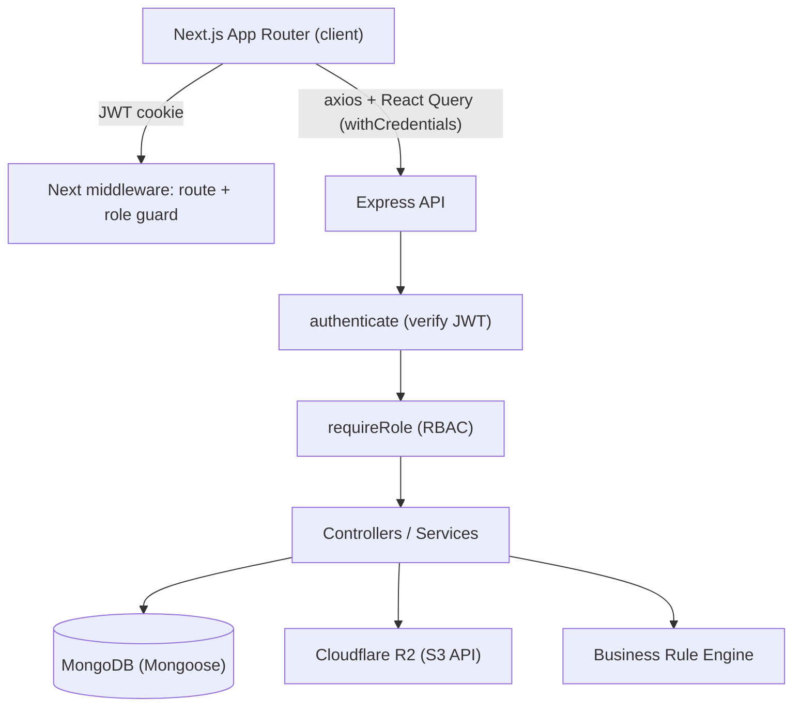
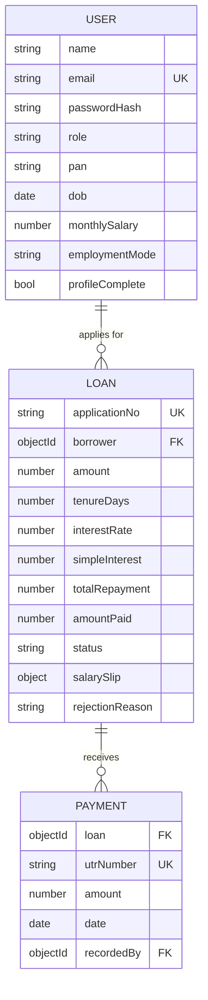
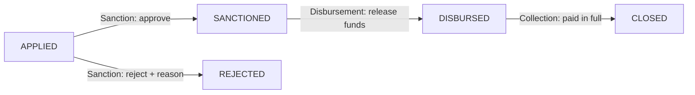

# LendFlow — Loan Management System

A full-stack lending platform where borrowers apply for loans through a guided, eligibility-checked flow, and internal teams manage each loan through its lifecycle — secured end-to-end by role-based access control. The product is branded **LendFlow** (an original design; not affiliated with any real lender).

- **Frontend:** Next.js (App Router) + TypeScript + Tailwind CSS + shadcn-style UI
- **Backend:** Node.js + Express + TypeScript
- **Database:** MongoDB + Mongoose
- **Auth:** JWT (httpOnly cookie) + bcrypt
- **File storage:** Cloudflare R2 (S3-compatible API) with presigned URLs

---

## Table of contents

- [Features](#features)
- [Architecture](#architecture)
- [Project structure](#project-structure)
- [Prerequisites](#prerequisites)
- [Setup](#setup)
- [Seeded login credentials](#seeded-login-credentials)
- [Data model](#data-model)
- [Loan lifecycle](#loan-lifecycle)
- [Business Rule Engine (BRE)](#business-rule-engine-bre)
- [Loan math](#loan-math)
- [Role-based access control](#role-based-access-control)
- [API reference](#api-reference)
- [Testing](#testing)
- [Deployment](#deployment)
- [Design decisions](#design-decisions)
- [Demo video script](#demo-video-script)

---

## Features

**Marketing site**

- Branded landing page with an interactive EMI/repayment calculator, value props, a 3-step explainer, eligibility criteria, and an FAQ accordion.

**Borrower portal** (sidebar layout: Dashboard, Apply, My Loans, Profile, Support)

- Sign up / log in (passwords hashed with bcrypt).
- Multi-step application wizard:
  1. Personal details + server-side eligibility check (BRE).
  2. Salary slip upload (PDF/JPG/PNG, max 5 MB) to Cloudflare R2.
  3. Loan configuration with live Simple Interest repayment panel.
- **Dashboard** with summary stats and an application **status timeline** (Applied → Sanctioned → Disbursed → Closed).
- **My Loans** with a human-readable application number, status timeline, repayment progress, payment history, and a secure (presigned) link to the uploaded salary slip.
- **Profile** and **Support** pages.

**Operations dashboard** (four role-guarded modules)

- **Sales** — pre-application leads (registered users without a loan).
- **Sanction** — review `APPLIED` loans; approve (→ `SANCTIONED`) or reject with a reason (→ `REJECTED`).
- **Disbursement** — release funds for `SANCTIONED` loans (→ `DISBURSED`).
- **Collection** — record repayments on `DISBURSED` loans (unique UTR, balance validation); loan auto-closes when fully repaid (→ `CLOSED`).
- **Admin** sees and can act in every module.

---

## Architecture



The frontend middleware performs UX-level redirects by decoding the JWT cookie, but the **backend re-verifies the token and the role on every request** — hiding a menu item is never the only defense.

---

## Project structure

```
LMS/
├── backend/                 # Express + TS API
│   └── src/
│       ├── config/          # env + Mongo connection
│       ├── models/          # User, Loan, Payment (Mongoose)
│       ├── middleware/       # auth, rbac, validate, error handler
│       ├── modules/          # auth, borrower, loans, uploads, ops
│       ├── services/         # bre.ts, storage.ts (R2)
│       ├── utils/            # ApiError, asyncHandler, jwt, loanMath
│       ├── seed/             # seed.ts
│       ├── app.ts            # Express app (routes + middleware)
│       └── server.ts         # bootstrap
├── frontend/                # Next.js App Router
│   └── src/
│       ├── app/
│       │   ├── page.tsx        # branded marketing landing page
│       │   ├── (auth)/         # login, signup
│       │   ├── (borrower)/     # portal dashboard, apply wizard, loans, profile, support
│       │   └── (dashboard)/    # ops modules
│       ├── components/        # ui/ (shadcn-style) + feature components
│       ├── hooks/             # useAuth, useOpsLoans
│       ├── lib/               # api client, types, roles, loan math
│       └── middleware.ts      # route + role guard
└── package.json             # convenience scripts for both apps
```

---

## Prerequisites

- Node.js 20+
- A MongoDB database (local `mongod` or a free [MongoDB Atlas](https://www.mongodb.com/atlas) cluster)
- A Cloudflare R2 bucket + API token (only required to exercise file upload/viewing)

---

## Setup

From the repository root you can install everything at once:

```bash
npm run install:all
```

### 1. Backend

```bash
cd backend
cp .env.example .env       # then edit values
npm install
npm run seed               # creates one account per role + sample data
npm run dev                # http://localhost:5000
```

Backend `.env`:

| Variable | Description |
| --- | --- |
| `PORT` | API port (default 5000) |
| `CLIENT_ORIGIN` | Frontend origin for CORS (e.g. `http://localhost:3000`) |
| `MONGODB_URI` | MongoDB connection string |
| `JWT_SECRET` | Secret used to sign JWTs |
| `JWT_EXPIRES_IN` | Token lifetime (e.g. `7d`) |
| `COOKIE_SECURE` | `true` only when serving over HTTPS |
| `R2_ACCOUNT_ID` / `R2_ACCESS_KEY_ID` / `R2_SECRET_ACCESS_KEY` / `R2_BUCKET` / `R2_ENDPOINT` | Cloudflare R2 (S3 API) credentials |
| `SEED_PASSWORD` | Password assigned to every seeded account |

### 2. Frontend

```bash
cd frontend
cp .env.example .env.local
npm install
npm run dev                # http://localhost:3000
```

Frontend `.env.local`:

| Variable | Description |
| --- | --- |
| `NEXT_PUBLIC_API_URL` | Base URL of the backend API, e.g. `http://localhost:5000/api` |

> **R2 note:** uploads/views call R2 directly. If you only want to demo the loan flow without R2, the seed script attaches a placeholder slip reference to sample loans so every dashboard module has data. To exercise real uploads, configure the `R2_*` variables.

---

## Seeded login credentials

`npm run seed` creates one account per role. The password for all of them is the value of `SEED_PASSWORD` (default `Password@123`).

| Role | Email | Password |
| --- | --- | --- |
| Admin | `admin@lms.test` | `Password@123` |
| Sales | `sales@lms.test` | `Password@123` |
| Sanction | `sanction@lms.test` | `Password@123` |
| Disbursement | `disbursement@lms.test` | `Password@123` |
| Collection | `collection@lms.test` | `Password@123` |
| Borrower | `borrower@lms.test` | `Password@123` |

The seed also creates extra borrowers and loans across `APPLIED`, `SANCTIONED`, and `DISBURSED` states so each dashboard module shows data immediately.

---

## Data model



- `salarySlip` stores the R2 object reference `{ key, bucket, mimeType, originalName }`; the file itself lives in a private R2 bucket and is served via short-lived presigned URLs.
- `utrNumber` has a unique index so the same bank transfer can never be recorded twice.

---

## Loan lifecycle



Each transition is validated server-side: the loan must be in the correct prior state, and only the owning role (or Admin) can trigger it.

---

## Business Rule Engine (BRE)

Runs **on the server** when personal details are submitted (`PUT /api/borrower/profile`). The application is blocked unless every rule passes.

| Rule | Rejection condition |
| --- | --- |
| Age | Not between 23 and 50 (inclusive), computed from DOB |
| Salary | Below Rs. 25,000 / month |
| PAN | Does not match `^[A-Z]{5}[0-9]{4}[A-Z]$` |
| Employment | Applicant is Unemployed |

All failing rules are returned together so the borrower can fix everything at once. The client mirrors these rules for instant feedback, but the server remains authoritative.

---

## Loan math

Simple Interest, fixed annual rate of **12%**:

```
SI    = (P × R × T) / (365 × 100)     // T = tenure in days
Total = P + SI
```

Computed and stored server-side at application time (`POST /api/loans`) — client-supplied amounts are never trusted for the stored figures.

---

## Role-based access control

| Module / action | Allowed roles |
| --- | --- |
| Borrower portal (apply, my loans) | Borrower |
| Sales leads | Sales, Admin |
| Loan lists (`/ops/loans`) | Sanction, Disbursement, Collection, Admin |
| Sanction (approve/reject) | Sanction, Admin |
| Disburse | Disbursement, Admin |
| Record payment | Collection, Admin |

- `authenticate` rejects missing/invalid tokens with **401**.
- `requireRole(...)` rejects an authenticated user with the wrong role with **403**.
- `ADMIN` bypasses all role checks.

---

## API reference

Base URL: `/api`. All protected routes require the `lms_token` httpOnly cookie.

### Auth

| Method | Path | Description |
| --- | --- | --- |
| POST | `/auth/signup` | Register a borrower, sets cookie |
| POST | `/auth/login` | Log in, sets cookie |
| POST | `/auth/logout` | Clear cookie |
| GET | `/auth/me` | Current user |

### Borrower

| Method | Path | Role | Description |
| --- | --- | --- | --- |
| PUT | `/borrower/profile` | Borrower | Save personal details, run BRE |
| POST | `/uploads/salary-slip` | Borrower | Upload slip to R2 (multipart `file`) |
| GET | `/uploads/view?key=` | Any (owner/exec) | Presigned view URL |
| POST | `/loans` | Borrower | Apply (server computes SI/total) |
| GET | `/loans/mine` | Borrower | List own loans |

### Loans & ops

| Method | Path | Role | Description |
| --- | --- | --- | --- |
| GET | `/loans/:id` | Owner / Exec | Loan detail |
| GET | `/loans/:id/payments` | Owner / Exec | Payment history |
| PATCH | `/loans/:id/sanction` | Sanction | `{ decision: APPROVE \| REJECT, reason? }` |
| PATCH | `/loans/:id/disburse` | Disbursement | Mark disbursed |
| POST | `/loans/:id/payments` | Collection | `{ utrNumber, amount, date? }`, auto-close |
| GET | `/ops/sales/leads` | Sales | Borrowers without loans |
| GET | `/ops/loans?status=` | Exec | Loans filtered by status (comma-separated) |

Standard error shape: `{ "message": string, "errors"?: unknown }`.

---

## Testing

The BRE and loan math (the correctness-graded logic) are covered by unit tests:

```bash
cd backend
npm test
```

---

## Deployment

The app is deployment-ready for **Vercel** (frontend) + **Render** (backend),
with MongoDB Atlas and Cloudflare R2 as managed dependencies. A Render Blueprint
([`render.yaml`](./render.yaml)) is included. See **[DEPLOYMENT.md](./DEPLOYMENT.md)**
for the full step-by-step guide.

Key production notes:

- The backend reads a comma-separated `CLIENT_ORIGIN` allow-list for CORS.
- Setting `COOKIE_SECURE=true` switches the auth cookie to `SameSite=None; Secure`
  so it works across the Vercel ↔ Render origins.

---

## Design decisions

- **PAN regex `^[A-Z]{5}[0-9]{4}[A-Z]$`** — the official Indian PAN format is exactly five letters, four digits, then one letter. Input is uppercased before validation.
- **Where does the BRE live?** On the **server**, because it is a gating business decision: a client-only check can be bypassed by calling the API directly. The client mirrors the rules purely for instant UX feedback.
- **Auth transport** — JWT in an **httpOnly cookie** so it isn't readable by JavaScript (mitigates XSS token theft). It is `SameSite=Lax` locally and automatically upgraded to `SameSite=None; Secure` in production (`COOKIE_SECURE=true`) so it survives the cross-site Vercel ↔ Render setup. The Next.js middleware can still read the cookie server-side for route/role redirects, while the API independently verifies the signature.
- **HTTP status codes** — `401` for unauthenticated, `403` for authenticated-but-forbidden, `409` for conflicts (duplicate email, duplicate UTR, invalid status transition).
- **Outstanding balance & auto-close** — tracked via `amountPaid` on the loan; each payment is validated (`amount > 0`, `amount <= outstanding`) and the loan flips to `CLOSED` the moment `amountPaid` reaches `totalRepayment`.
- **Private file storage** — salary slips are stored in a private R2 bucket and only ever exposed through short-lived presigned URLs, authorized per request (borrowers can only view their own).

---

## Demo video script

A suggested 3–5 minute flow:

1. **BRE fail** — sign up as a new borrower, enter an underage DOB / low salary / unemployed; show the rejection messages.
2. **BRE pass** — correct the details; eligibility passes.
3. **Apply** — upload a salary slip, move the amount/tenure sliders (watch the live repayment update), submit.
4. **Sanction** — log in as `sanction@lms.test`, approve the application.
5. **Disburse** — log in as `disbursement@lms.test`, mark the loan disbursed.
6. **Collect** — log in as `collection@lms.test`, record a payment for the full outstanding balance; show the loan auto-close.
7. **RBAC** — show that a Sales user cannot open the Sanction module (and that the API returns 403), while Admin can open all modules.
```
